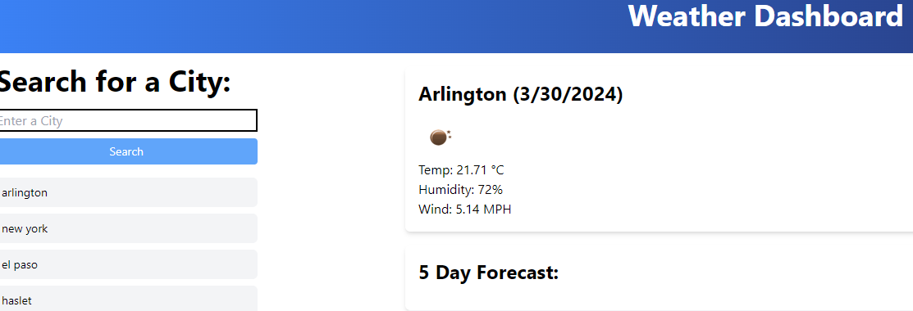

<b>Weather Dashboard</b> 

Welcome to my weather dashboard. The goal of this project was to build from scratch a weather dashboard that implements fetching data from an API and display information onto the page. The page also displays the searched city’s weather along with a 5-day forecast. With every search still stashing on the page and with the function of being able to select the stashed result and display the data once more.  

This project was challenging and fun. I was not required to use tailwind, but I wanted to practice with it. I learned how much quicker and better the styling was and how much I was able to accomplish with it. I see tailwind to be used in my future of coding. The API fetching took a good amount of research but was a fun challenge in the end.  

Here is a link to my Weather Dashboard:

https://tcarocci.github.io/weather-dashboard/ 

Screenshot of what the site should look like! 

 